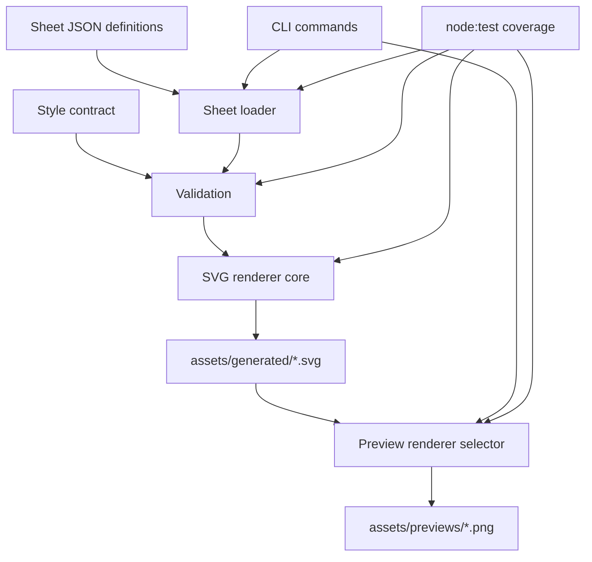

# SVG Factory Hardening - Plan

## Goal Capsule

| Field | Plan |
|---|---|
| Objective | Turn the existing SVG factory into a repeatable local asset-generation workflow for White Board History sheets. |
| Authority | Preserve the ideation doc's priority order: definition-driven generation, style consistency, preview validation, then future library bootstrapping. |
| Execution profile | Standard software plan; no dependency-heavy rewrite; keep generated SVGs plain, editable, and Cavalry-friendly. |
| Stop conditions | Stop if implementation requires changing the channel's visual language, adopting a GUI-first workflow, or choosing third-party source-library licensing policy. |
| Tail ownership | This plan owns hardening the local CLI and documentation; importer and whole-scene recipe work are follow-up plans. |

---

## Product Contract

### Summary

This plan hardens the early SVG factory already present in the repo so Codex can add white-board-history assets by editing structured definitions and reusable renderers instead of hand-authoring whole SVG files.
The work keeps the current no-dependency Node CLI, adds testable seams around sheet loading, validation, style tokens, rendering, and preview selection, and updates docs so new assets follow the house style.

### Problem Frame

The repo has useful hand-authored SVG sheets in `assets/svg/` and an emerging generated pilot sheet in `assets/generated/byzantium-pilot.svg`.
The current generator proves the direction, but its palette, validation rules, renderers, and command orchestration live in one file, which makes the style contract harder to enforce and test.
Without a tighter factory boundary, future assets will drift in stroke width, palette, layout, and preview quality even if they are technically valid SVG.

### Requirements

**Definition-driven generation**

- R1. The factory reads structured sheet definitions and renders deterministic SVG sheets under `assets/generated/`.
- R2. The CLI continues to support listing, generating, previewing one sheet, and processing all sheets through existing package scripts.
- R3. Renderers remain plain JavaScript and produce editable SVG groups with stable asset IDs suitable for Cavalry import.

**Style consistency**

- R4. The house-style palette, stroke widths, card rules, typography, and sheet defaults are centralized in a reusable style contract.
- R5. Validation rejects unsupported accents, duplicate IDs, missing required fields, unsupported renderer types, and invalid numeric layout values before writing output.
- R6. Validation warns or fails on generated SVG that violates the style contract where the violation is detectable without a full SVG parser.

**Preview and QA**

- R7. Preview generation keeps using local renderers, preferring a high-fidelity renderer when available and falling back to macOS `sips` when appropriate.
- R8. Preview errors explain the missing prerequisite or missing generated SVG without leaving users guessing which command to run next.
- R9. Generated SVG and PNG preview outputs remain reproducible artifacts rather than hand-edited source; sheet JSON, renderers, style contract, tests, and docs are the canonical editable surface.

**Documentation and future readiness**

- R10. Documentation explains how to add a new sheet item, how to choose accents and primitive types, and how to validate output before using assets in Cavalry.
- R11. The design leaves room for future source-library import and scene recipe generation without including those features in this pass.

### Scope Boundaries

#### In Scope

- Harden the existing `tools/svg-factory` CLI rather than replacing it.
- Add a small internal module structure so the generator core can be tested without invoking the process entry point.
- Add a repo-local test script using Node's built-in test runner.
- Preserve the current Byzantium pilot sheet as the characterization fixture for generated output.

#### Deferred to Follow-Up Work

- Source-library importer for Game-icons, Tabler, or any other third-party SVG set, including attribution metadata policy.
- Whole-scene recipe generation for complete 16:9 boards such as `byzantium-siege`.
- SVGO, browser preview UI, or a dedicated web app.
- Cavalry automation beyond generating import-friendly SVG groups and previews.

### Acceptance Examples

- AE1. Given a valid sheet definition, when the user runs the generate command for that sheet, then the factory writes one deterministic SVG with the expected title, viewBox, and item group IDs.
- AE2. Given a sheet item with an unsupported accent or renderer type, when validation runs, then the command fails before writing output and identifies the offending item.
- AE3. Given a generated sheet and a supported local renderer, when the user runs the preview command, then the factory writes a PNG preview under `assets/previews/`.
- AE4. Given no supported local preview renderer, when the user runs the preview command, then the command fails with a clear renderer-prerequisite message.
- AE5. Given a creator adding a new asset, when they read the docs, then they can identify the source files to edit, the style constraints to honor, and the validation/preview workflow to use.

---

## Planning Contract

### Key Technical Decisions

- KTD1. **Keep the no-dependency Node CLI.** The repo is currently a small asset pack with no install step beyond Node, and the ideation doc rejects GUI coupling and dependency setup friction for the first useful tool.
- KTD2. **Split core modules before adding behavior.** `tools/svg-factory/cli.mjs` currently mixes command routing, filesystem paths, validation, style tokens, and renderer functions; testing requires importable modules with no process side effects.
- KTD3. **Make the style contract executable.** `assets/README.md` already defines palette and stroke rules; moving those values into a generator-owned contract lets rendering and validation share the same source instead of duplicating prose and constants.
- KTD4. **Use Node's built-in test runner.** Official Node documentation supports a built-in `node:test` module and `node --test`, which fits the no-dependency constraint while still giving the generator regression coverage.
- KTD5. **Prefer renderer selection over renderer abstraction.** Preview generation should pick from known local tools and report what happened; a plugin system would be premature before importer and scene-recipe work exist.

### High-Level Technical Design

The CLI remains the user entry point, but command routing delegates to importable modules.
Sheet definitions flow through loader and validation before rendering, and preview selection consumes generated SVGs rather than regenerating them.
Tests exercise the modules directly so regressions are caught without depending on local renderer availability.

### Assumptions

- Generated outputs stay checked in or regenerated according to the user's current workflow; this plan does not decide repository artifact policy beyond keeping source definitions canonical.
- The minimum Node version is whatever supports ESM and `node:test` in the user's local environment; the implementation should avoid syntax or APIs newer than necessary.
- Pixel-perfect visual equivalence across `sips`, Inkscape, browsers, and Cavalry is out of scope; preview is a fast QA aid, not the final render authority.

### Deferred Implementation Notes

- Decide during implementation whether regenerated SVG and PNG outputs should be committed in this repo or treated as local build artifacts; this plan only requires that they are reproducible from canonical source files.

### Sources & Research

- `docs/ideation/2026-07-04-svg-factory-ideation.md` ranks definition-driven generation, style validation, and preview harness work above importer and scene recipe features.
- `tools/svg-factory/cli.mjs` already implements list, generate, preview, palette validation, renderer functions, and macOS/Inkscape preview selection in one file.
- `assets/README.md` is the current prose source for house style: white background, black ink, muted secondary ink, 4 px primary strokes, 2.5 px interior strokes, restrained rounded corners, and faction accents.
- Node official docs describe `node:test` and `node --test` as built-in testing surfaces, which supports adding coverage without external dependencies.
- Inkscape command-line documentation supports PNG export through `--export-type=png` and `--export-filename`, matching the existing preview direction.

---

## Implementation Units

### U1. Extract Testable SVG Factory Modules

- **Goal:** Move generator internals out of the process entry point so sheet loading, validation, rendering, and preview selection can be tested directly.
- **Requirements:** R1, R2, R3, R5.
- **Dependencies:** None.
- **Files:** `tools/svg-factory/cli.mjs`, `tools/svg-factory/paths.mjs`, `tools/svg-factory/sheets.mjs`, `tools/svg-factory/render.mjs`, `tools/svg-factory/preview.mjs`, `tools/svg-factory/svg-factory.test.mjs`, `package.json`.
- **Approach:** Keep `cli.mjs` as a thin command router and move path constants, sheet discovery/loading, rendering helpers, and preview renderer selection into importable modules. Preserve existing command behavior and output paths while making functions accept explicit paths where tests need temporary fixtures.
- **Execution note:** Start with characterization tests around the current Byzantium pilot flow before changing output structure.
- **Patterns to follow:** Current `package.json` scripts, current `tools/svg-factory/cli.mjs` command names, current output directories in `assets/generated/` and `assets/previews/`.
- **Test scenarios:**
  - Happy path: given the existing `byzantium-pilot` sheet, loading returns the expected sheet name, dimensions, and item count.
  - Happy path: rendering the existing sheet produces an SVG with one root `<svg>`, the expected title, the expected `viewBox`, and stable groups for known item IDs.
  - Edge case: listing sheets sorts JSON filenames and omits non-JSON files in the sheets directory.
  - Error path: loading an unknown sheet rejects with an error that names the unknown sheet and points users toward listing available sheets.
  - Integration: invoking the generate command through the CLI still writes `assets/generated/byzantium-pilot.svg` with equivalent structural markers to the current generated file.
- **Verification:** Existing package scripts still address the same commands, and module-level tests can run without invoking a local preview renderer.

### U2. Centralize the House Style Contract

- **Goal:** Make palette, stroke widths, typography, card defaults, and sheet defaults a single executable contract used by renderers, validation, and documentation.
- **Requirements:** R3, R4, R5, R6, R10.
- **Dependencies:** U1.
- **Files:** `tools/svg-factory/style.mjs`, `tools/svg-factory/render.mjs`, `tools/svg-factory/validate.mjs`, `tools/svg-factory/svg-factory.test.mjs`, `assets/README.md`, `tools/svg-factory/README.md`.
- **Approach:** Move hard-coded style values out of renderer bodies into a named style module. Validation should check sheet and item data against the contract, while renderers consume the same contract for CSS classes, accent colors, card geometry, and text styling.
- **Patterns to follow:** The style rules already documented in `assets/README.md`; existing palette keys in `tools/svg-factory/cli.mjs`.
- **Test scenarios:**
  - Happy path: every accent listed in the style contract can be used by a valid item and renders to the expected color value.
  - Happy path: generated sheet CSS uses contract values for card stroke, primary ink, thin stroke, label text, and muted text.
  - Edge case: neutral or omitted accent resolves to the expected default without duplicating fallback logic in each renderer.
  - Error path: an item with an unsupported accent fails validation before rendering and identifies the item ID.
  - Error path: a renderer attempting to use a color outside the contract is caught by a detectable style validation rule or covered by a focused renderer test.
  - Integration: docs list the same accent names and values as the style contract.
- **Verification:** Style updates require changing one module and tests fail if docs or generated CSS drift from that contract.

### U3. Harden Sheet and Item Validation

- **Goal:** Expand validation from basic required keys to a creator-friendly contract for sheet metadata, item geometry, renderer props, IDs, labels, and output safety.
- **Requirements:** R1, R5, R6, R8, R10.
- **Dependencies:** U1, U2.
- **Files:** `tools/svg-factory/validate.mjs`, `tools/svg-factory/sheets.mjs`, `tools/svg-factory/renderers.mjs`, `tools/svg-factory/svg-factory.test.mjs`, `tools/svg-factory/sheets/byzantium-pilot.json`, `tools/svg-factory/README.md`.
- **Approach:** Introduce validation helpers that distinguish sheet-level errors from item-level errors. Keep checks simple and deterministic: required fields, finite numeric coordinates and dimensions, unique IDs, known renderer types, renderer-specific required props, and safe label/value escaping.
- **Patterns to follow:** Existing `validateSheet` behavior in `tools/svg-factory/cli.mjs`; existing `esc()` helper for text escaping; existing renderer type names in `byzantium-pilot.json`.
- **Test scenarios:**
  - Happy path: `byzantium-pilot.json` passes validation with no errors.
  - Edge case: `value` for meter-like items clamps or fails according to the chosen contract, and the expected behavior is documented.
  - Edge case: labels containing XML-sensitive characters render escaped text instead of raw markup.
  - Error path: missing sheet `name`, `title`, `width`, `height`, or `items` reports a sheet-level error.
  - Error path: duplicate item IDs report the duplicated ID.
  - Error path: non-finite coordinates, negative card dimensions, missing labels, or unknown renderer types report the offending item ID.
  - Integration: CLI generate exits before writing output when validation fails.
- **Verification:** Invalid sheet fixtures fail with actionable messages, and the valid pilot fixture remains accepted.

### U4. Stabilize Primitive Renderers and Output Shape

- **Goal:** Make primitive renderers easier to extend while preserving plain editable SVG groups and the existing white-board-history visual system.
- **Requirements:** R1, R3, R4, R6, R11.
- **Dependencies:** U1, U2, U3.
- **Files:** `tools/svg-factory/renderers.mjs`, `tools/svg-factory/render.mjs`, `tools/svg-factory/svg-factory.test.mjs`, `assets/generated/byzantium-pilot.svg`.
- **Approach:** Move primitive renderers into a renderer registry module with shared helpers for cards, labels, accents, clamping, and escaping. Keep custom path work allowed inside individual renderers, but make common catalogue-card, label, and accent behavior shared.
- **Patterns to follow:** Existing renderers for wall, Bosporus, cannon battery, relief ships, meters, map, and verdict card; existing group ID per item; current 1600 x 900 sheet scale.
- **Test scenarios:**
  - Happy path: every renderer type used by the pilot sheet returns SVG content wrapped inside the item's stable group ID.
  - Happy path: shared card and label helpers produce consistent dimensions, radius, text anchor, and class usage across renderers.
  - Edge case: custom `cardWidth` and `cardHeight` override defaults without changing unrelated renderer behavior.
  - Error path: renderer registry lookup fails validation for unsupported types rather than failing during rendering.
  - Integration: regenerating the pilot sheet produces deterministic output for repeated runs with the same input.
- **Verification:** Adding a new primitive means registering one renderer and adding focused tests, not editing command routing or duplicating style constants.

### U5. Improve Preview Workflow and Renderer Feedback

- **Goal:** Make PNG preview generation reliable enough for fast visual QA while keeping local renderer differences explicit.
- **Requirements:** R7, R8, R9, R10.
- **Dependencies:** U1.
- **Files:** `tools/svg-factory/preview.mjs`, `tools/svg-factory/cli.mjs`, `tools/svg-factory/svg-factory.test.mjs`, `tools/svg-factory/README.md`, `assets/README.md`.
- **Approach:** Isolate renderer detection and preview execution behind functions that can be tested with injected command availability. Prefer Inkscape when present for SVG export fidelity, fall back to `sips` on macOS, and produce clear errors for missing generated SVGs or missing renderers.
- **Patterns to follow:** Current `renderPreview`, `commandExists`, and preview directory behavior in `tools/svg-factory/cli.mjs`.
- **Test scenarios:**
  - Happy path: when Inkscape is available, preview selection chooses it and builds the expected export arguments.
  - Happy path: when Inkscape is unavailable and `sips` is available, preview selection chooses `sips`.
  - Edge case: when both renderers are available, the chosen precedence is stable and documented.
  - Error path: when no renderer is available, preview fails with a message that names supported renderer options.
  - Error path: when the generated SVG is missing, preview fails with a message telling the user to generate first.
  - Integration: preview writes PNGs to `assets/previews/` for the requested sheet name.
- **Verification:** Renderer selection can be proven in tests without requiring the test machine to have both renderers installed.

### U6. Document the Authoring Workflow and Future Extension Points

- **Goal:** Make the SVG factory usable by a future Codex pass or human editor without re-reading the implementation.
- **Requirements:** R9, R10, R11, AE5.
- **Dependencies:** U2, U3, U4, U5.
- **Files:** `tools/svg-factory/README.md`, `assets/README.md`, `docs/ideation/2026-07-04-svg-factory-ideation.md`.
- **Approach:** Update docs with the source-of-truth hierarchy, sheet item fields, style contract, validation behavior, preview renderer notes, and deferred extension points for importer and scene recipes. Leave the ideation doc unchanged unless adding a short pointer to the implementation plan is useful.
- **Patterns to follow:** Existing concise README style; existing `assets/README.md` Cavalry workflow notes.
- **Test scenarios:**
  - Happy path: a reader can identify which JSON file to edit for an existing sheet and which module to extend for a new primitive.
  - Happy path: docs state that `assets/generated/` and `assets/previews/` are outputs while sheet JSON and renderer modules are canonical.
  - Edge case: docs explain renderer differences so a visual mismatch between `sips`, Inkscape, and Cavalry is treated as a QA signal rather than a generator failure.
  - Integration: documented commands match `package.json` scripts.
- **Verification:** Documentation and scripts agree, and a new creator can follow the README to add, generate, validate, and preview an asset.

---

## Verification Contract

| Gate | Applies To | Done Signal |
|---|---|---|
| Node unit tests | U1, U2, U3, U4, U5 | The repo has a `test` script backed by Node's built-in test runner, and generator module tests pass. |
| Generate smoke | U1, U3, U4 | Running the existing generate workflow produces `assets/generated/byzantium-pilot.svg` with stable title, viewBox, and group IDs. |
| Preview smoke | U5 | Running the preview workflow on a machine with a supported renderer writes `assets/previews/byzantium-pilot.png`, or reports a clear missing-renderer message. |
| Documentation check | U2, U5, U6 | `tools/svg-factory/README.md`, `assets/README.md`, and `package.json` describe the same command names, source files, and output paths. |
| Cavalry-readiness check | U3, U4, U6 | Generated SVG remains plain SVG with named groups per item and no dependency on runtime scripts or external assets. |

---

## Definition of Done

- The CLI still supports the existing list, generate, preview, and all-assets workflows.
- The generator core is split into importable modules with focused tests for loading, validation, rendering, renderer registry behavior, and preview selection.
- The house style contract is centralized and shared by renderers, validation, and docs.
- Invalid sheet definitions fail before output is written and identify the sheet or item that needs attention.
- The Byzantium pilot sheet remains the characterization fixture and can be regenerated deterministically.
- Preview behavior is documented and testable without requiring every supported renderer to be installed on the test machine.
- Importer and scene recipe work are deferred explicitly rather than partially implemented.
- Dead-end refactors, temporary fixtures outside tests, and unused experimental code are removed before landing.
